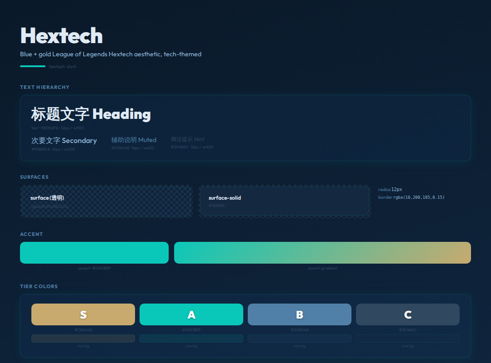

# Hextech




> Blue + gold League of Legends Hextech aesthetic, tech-themed

**分类**: 暗色 · **ID**: `hextech`

## Background

<div style="width:100%;height:60px;border-radius:8px;background:linear-gradient(165deg, #0A1929 0%, #0D2137 50%, #122A45 100%);border:1px solid rgba(128,128,128,0.15);margin:8px 0;"></div>


```css
background: linear-gradient(165deg, #0A1929 0%, #0D2137 50%, #122A45 100%);
```

## Surface & Card

<table>
<tr><td>surface</td><td><span style="display:inline-block;width:20px;height:20px;border-radius:4px;background:rgba(30,90,160,0.10);border:1px solid rgba(128,128,128,0.2);vertical-align:middle;"></span></td><td><code>rgba(30,90,160,0.10)</code></td></tr>
<tr><td>surface-solid</td><td><span style="display:inline-block;width:20px;height:20px;border-radius:4px;background:#142840;border:1px solid rgba(128,128,128,0.2);vertical-align:middle;"></span></td><td><code>#142840</code></td></tr>
<tr><td>border</td><td><span style="display:inline-block;width:20px;height:20px;border-radius:4px;background:rgba(10,200,185,0.15);border:1px solid rgba(128,128,128,0.2);vertical-align:middle;"></span></td><td><code>rgba(10,200,185,0.15)</code></td></tr>
<tr><td>card-shadow</td><td></td><td><code>0 4px 24px rgba(10,200,185,0.08)</code></td></tr>
<tr><td>card-radius</td><td></td><td><code>12px</code></td></tr>
<tr><td>card-backdrop</td><td></td><td><code>—</code></td></tr>
</table>

## Text

<div style="display:flex;gap:12px;flex-wrap:wrap;margin:12px 0;">
<div style="text-align:center;"><div style="width:80px;height:44px;background:#0A1929;border-radius:6px;border:1px solid rgba(128,128,128,0.15);display:flex;align-items:center;justify-content:center;"><span style="color:#E0EAF4;font-weight:600;font-size:14px;">Aa</span></div><div style="font-size:11px;color:#888;margin-top:4px;">Primary<br/><code style="font-size:10px;">#E0EAF4</code></div></div>
<div style="text-align:center;"><div style="width:80px;height:44px;background:#0A1929;border-radius:6px;border:1px solid rgba(128,128,128,0.15);display:flex;align-items:center;justify-content:center;"><span style="color:#90B8DA;font-weight:600;font-size:14px;">Aa</span></div><div style="font-size:11px;color:#888;margin-top:4px;">Secondary<br/><code style="font-size:10px;">#90B8DA</code></div></div>
<div style="text-align:center;"><div style="width:80px;height:44px;background:#0A1929;border-radius:6px;border:1px solid rgba(128,128,128,0.15);display:flex;align-items:center;justify-content:center;"><span style="color:#5080A8;font-weight:600;font-size:14px;">Aa</span></div><div style="font-size:11px;color:#888;margin-top:4px;">Muted<br/><code style="font-size:10px;">#5080A8</code></div></div>
<div style="text-align:center;"><div style="width:80px;height:44px;background:#0A1929;border-radius:6px;border:1px solid rgba(128,128,128,0.15);display:flex;align-items:center;justify-content:center;"><span style="color:#304860;font-weight:600;font-size:14px;">Aa</span></div><div style="font-size:11px;color:#888;margin-top:4px;">Hint<br/><code style="font-size:10px;">#304860</code></div></div>
</div>

## Accent

<div style="display:flex;gap:16px;align-items:center;margin:12px 0;">
<div style="text-align:center;"><div style="width:64px;height:36px;border-radius:6px;background:#0AC8B9;"></div><div style="font-size:11px;color:#888;margin-top:4px;">Accent<br/><code style="font-size:10px;">#0AC8B9</code></div></div>
<div style="text-align:center;"><div style="width:120px;height:36px;border-radius:6px;background:linear-gradient(135deg, #0AC8B9, #C8AA6E);"></div><div style="font-size:11px;color:#888;margin-top:4px;">Gradient</div></div>
</div>

## Tier Colors

<div style="display:flex;gap:12px;flex-wrap:wrap;margin:12px 0;">
<div style="text-align:center;"><div style="width:64px;height:44px;border-radius:8px;background:#C8AA6E;display:flex;align-items:center;justify-content:center;"><span style="color:white;font-weight:900;font-size:20px;text-shadow:0 1px 3px rgba(0,0,0,0.3);">S</span></div><div style="font-size:10px;color:#888;margin-top:4px;"><code>#C8AA6E</code></div></div>
<div style="text-align:center;"><div style="width:64px;height:44px;border-radius:8px;background:#0AC8B9;display:flex;align-items:center;justify-content:center;"><span style="color:white;font-weight:900;font-size:20px;text-shadow:0 1px 3px rgba(0,0,0,0.3);">A</span></div><div style="font-size:10px;color:#888;margin-top:4px;"><code>#0AC8B9</code></div></div>
<div style="text-align:center;"><div style="width:64px;height:44px;border-radius:8px;background:#5080A8;display:flex;align-items:center;justify-content:center;"><span style="color:white;font-weight:900;font-size:20px;text-shadow:0 1px 3px rgba(0,0,0,0.3);">B</span></div><div style="font-size:10px;color:#888;margin-top:4px;"><code>#5080A8</code></div></div>
<div style="text-align:center;"><div style="width:64px;height:44px;border-radius:8px;background:#304860;display:flex;align-items:center;justify-content:center;"><span style="color:white;font-weight:900;font-size:20px;text-shadow:0 1px 3px rgba(0,0,0,0.3);">C</span></div><div style="font-size:10px;color:#888;margin-top:4px;"><code>#304860</code></div></div>
</div>

<table>
<tr><th>Tier</th><th>Color</th><th>Row BG</th><th>Gradient</th></tr>
<tr><td><strong>S</strong></td><td><span style="display:inline-block;width:20px;height:20px;border-radius:4px;background:#C8AA6E;border:1px solid rgba(128,128,128,0.2);vertical-align:middle;"></span> <code>#C8AA6E</code></td><td><span style="display:inline-block;width:20px;height:20px;border-radius:4px;background:rgba(200,170,110,0.12);border:1px solid rgba(128,128,128,0.2);vertical-align:middle;"></span> <code>rgba(200,170,110,0.12)</code></td><td>— </td></tr>
<tr><td><strong>A</strong></td><td><span style="display:inline-block;width:20px;height:20px;border-radius:4px;background:#0AC8B9;border:1px solid rgba(128,128,128,0.2);vertical-align:middle;"></span> <code>#0AC8B9</code></td><td><span style="display:inline-block;width:20px;height:20px;border-radius:4px;background:rgba(10,200,185,0.10);border:1px solid rgba(128,128,128,0.2);vertical-align:middle;"></span> <code>rgba(10,200,185,0.10)</code></td><td>— </td></tr>
<tr><td><strong>B</strong></td><td><span style="display:inline-block;width:20px;height:20px;border-radius:4px;background:#5080A8;border:1px solid rgba(128,128,128,0.2);vertical-align:middle;"></span> <code>#5080A8</code></td><td><span style="display:inline-block;width:20px;height:20px;border-radius:4px;background:rgba(80,128,168,0.08);border:1px solid rgba(128,128,128,0.2);vertical-align:middle;"></span> <code>rgba(80,128,168,0.08)</code></td><td>— </td></tr>
<tr><td><strong>C</strong></td><td><span style="display:inline-block;width:20px;height:20px;border-radius:4px;background:#304860;border:1px solid rgba(128,128,128,0.2);vertical-align:middle;"></span> <code>#304860</code></td><td><span style="display:inline-block;width:20px;height:20px;border-radius:4px;background:rgba(48,72,96,0.06);border:1px solid rgba(128,128,128,0.2);vertical-align:middle;"></span> <code>rgba(48,72,96,0.06)</code></td><td>— </td></tr>
</table>

## Typography

<table><tr><th>Role</th><th>Font</th></tr>
<tr><td>heading</td><td><code>Outfit</code></td></tr>
<tr><td>body</td><td><code>Outfit</code></td></tr>
<tr><td>cjk</td><td><code>Noto Sans CJK SC</code></td></tr>
</table>

## 相关
- [[design-tokens]] — 全局共享token
- [[style-graphite]]
- [[style-midnight]]
