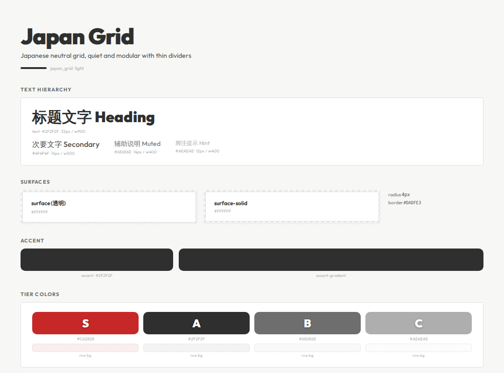

# Japan Grid




> Japanese neutral grid, quiet and modular with thin dividers

**分类**: 亮色 · **ID**: `japan_grid`

## Background

<div style="width:100%;height:60px;border-radius:8px;background:#F7F8F6;border:1px solid rgba(128,128,128,0.15);margin:8px 0;"></div>


```css
background: #F7F8F6;
```

## Surface & Card

<table>
<tr><td>surface</td><td><span style="display:inline-block;width:20px;height:20px;border-radius:4px;background:#FFFFFF;border:1px solid rgba(128,128,128,0.2);vertical-align:middle;"></span></td><td><code>#FFFFFF</code></td></tr>
<tr><td>surface-solid</td><td><span style="display:inline-block;width:20px;height:20px;border-radius:4px;background:#FFFFFF;border:1px solid rgba(128,128,128,0.2);vertical-align:middle;"></span></td><td><code>#FFFFFF</code></td></tr>
<tr><td>border</td><td><span style="display:inline-block;width:20px;height:20px;border-radius:4px;background:#DADFE3;border:1px solid rgba(128,128,128,0.2);vertical-align:middle;"></span></td><td><code>#DADFE3</code></td></tr>
<tr><td>card-shadow</td><td></td><td><code>none</code></td></tr>
<tr><td>card-radius</td><td></td><td><code>4px</code></td></tr>
<tr><td>card-backdrop</td><td></td><td><code>—</code></td></tr>
</table>

## Text

<div style="display:flex;gap:12px;flex-wrap:wrap;margin:12px 0;">
<div style="text-align:center;"><div style="width:80px;height:44px;background:#F7F8F6;border-radius:6px;border:1px solid rgba(128,128,128,0.15);display:flex;align-items:center;justify-content:center;"><span style="color:#2F2F2F;font-weight:600;font-size:14px;">Aa</span></div><div style="font-size:11px;color:#888;margin-top:4px;">Primary<br/><code style="font-size:10px;">#2F2F2F</code></div></div>
<div style="text-align:center;"><div style="width:80px;height:44px;background:#F7F8F6;border-radius:6px;border:1px solid rgba(128,128,128,0.15);display:flex;align-items:center;justify-content:center;"><span style="color:#4F4F4F;font-weight:600;font-size:14px;">Aa</span></div><div style="font-size:11px;color:#888;margin-top:4px;">Secondary<br/><code style="font-size:10px;">#4F4F4F</code></div></div>
<div style="text-align:center;"><div style="width:80px;height:44px;background:#F7F8F6;border-radius:6px;border:1px solid rgba(128,128,128,0.15);display:flex;align-items:center;justify-content:center;"><span style="color:#6E6E6E;font-weight:600;font-size:14px;">Aa</span></div><div style="font-size:11px;color:#888;margin-top:4px;">Muted<br/><code style="font-size:10px;">#6E6E6E</code></div></div>
<div style="text-align:center;"><div style="width:80px;height:44px;background:#F7F8F6;border-radius:6px;border:1px solid rgba(128,128,128,0.15);display:flex;align-items:center;justify-content:center;"><span style="color:#AEAEAE;font-weight:600;font-size:14px;">Aa</span></div><div style="font-size:11px;color:#888;margin-top:4px;">Hint<br/><code style="font-size:10px;">#AEAEAE</code></div></div>
</div>

## Accent

<div style="display:flex;gap:16px;align-items:center;margin:12px 0;">
<div style="text-align:center;"><div style="width:64px;height:36px;border-radius:6px;background:#2F2F2F;"></div><div style="font-size:11px;color:#888;margin-top:4px;">Accent<br/><code style="font-size:10px;">#2F2F2F</code></div></div>
</div>

## Tier Colors

<div style="display:flex;gap:12px;flex-wrap:wrap;margin:12px 0;">
<div style="text-align:center;"><div style="width:64px;height:44px;border-radius:8px;background:#C62828;display:flex;align-items:center;justify-content:center;"><span style="color:white;font-weight:900;font-size:20px;text-shadow:0 1px 3px rgba(0,0,0,0.3);">S</span></div><div style="font-size:10px;color:#888;margin-top:4px;"><code>#C62828</code></div></div>
<div style="text-align:center;"><div style="width:64px;height:44px;border-radius:8px;background:#2F2F2F;display:flex;align-items:center;justify-content:center;"><span style="color:white;font-weight:900;font-size:20px;text-shadow:0 1px 3px rgba(0,0,0,0.3);">A</span></div><div style="font-size:10px;color:#888;margin-top:4px;"><code>#2F2F2F</code></div></div>
<div style="text-align:center;"><div style="width:64px;height:44px;border-radius:8px;background:#6E6E6E;display:flex;align-items:center;justify-content:center;"><span style="color:white;font-weight:900;font-size:20px;text-shadow:0 1px 3px rgba(0,0,0,0.3);">B</span></div><div style="font-size:10px;color:#888;margin-top:4px;"><code>#6E6E6E</code></div></div>
<div style="text-align:center;"><div style="width:64px;height:44px;border-radius:8px;background:#AEAEAE;display:flex;align-items:center;justify-content:center;"><span style="color:white;font-weight:900;font-size:20px;text-shadow:0 1px 3px rgba(0,0,0,0.3);">C</span></div><div style="font-size:10px;color:#888;margin-top:4px;"><code>#AEAEAE</code></div></div>
</div>

<table>
<tr><th>Tier</th><th>Color</th><th>Row BG</th><th>Gradient</th></tr>
<tr><td><strong>S</strong></td><td><span style="display:inline-block;width:20px;height:20px;border-radius:4px;background:#C62828;border:1px solid rgba(128,128,128,0.2);vertical-align:middle;"></span> <code>#C62828</code></td><td><span style="display:inline-block;width:20px;height:20px;border-radius:4px;background:rgba(198,40,40,0.08);border:1px solid rgba(128,128,128,0.2);vertical-align:middle;"></span> <code>rgba(198,40,40,0.08)</code></td><td>— </td></tr>
<tr><td><strong>A</strong></td><td><span style="display:inline-block;width:20px;height:20px;border-radius:4px;background:#2F2F2F;border:1px solid rgba(128,128,128,0.2);vertical-align:middle;"></span> <code>#2F2F2F</code></td><td><span style="display:inline-block;width:20px;height:20px;border-radius:4px;background:rgba(47,47,47,0.06);border:1px solid rgba(128,128,128,0.2);vertical-align:middle;"></span> <code>rgba(47,47,47,0.06)</code></td><td>— </td></tr>
<tr><td><strong>B</strong></td><td><span style="display:inline-block;width:20px;height:20px;border-radius:4px;background:#6E6E6E;border:1px solid rgba(128,128,128,0.2);vertical-align:middle;"></span> <code>#6E6E6E</code></td><td><span style="display:inline-block;width:20px;height:20px;border-radius:4px;background:rgba(110,110,110,0.04);border:1px solid rgba(128,128,128,0.2);vertical-align:middle;"></span> <code>rgba(110,110,110,0.04)</code></td><td>— </td></tr>
<tr><td><strong>C</strong></td><td><span style="display:inline-block;width:20px;height:20px;border-radius:4px;background:#AEAEAE;border:1px solid rgba(128,128,128,0.2);vertical-align:middle;"></span> <code>#AEAEAE</code></td><td><span style="display:inline-block;width:20px;height:20px;border-radius:4px;background:rgba(174,174,174,0.03);border:1px solid rgba(128,128,128,0.2);vertical-align:middle;"></span> <code>rgba(174,174,174,0.03)</code></td><td>— </td></tr>
</table>

## Typography

<table><tr><th>Role</th><th>Font</th></tr>
<tr><td>heading</td><td><code>Outfit</code></td></tr>
<tr><td>body</td><td><code>Outfit</code></td></tr>
<tr><td>cjk</td><td><code>Noto Sans CJK SC</code></td></tr>
</table>

## 相关
- [[design-tokens]] — 全局共享token
- [[style-cream]]
- [[style-sigma]]
