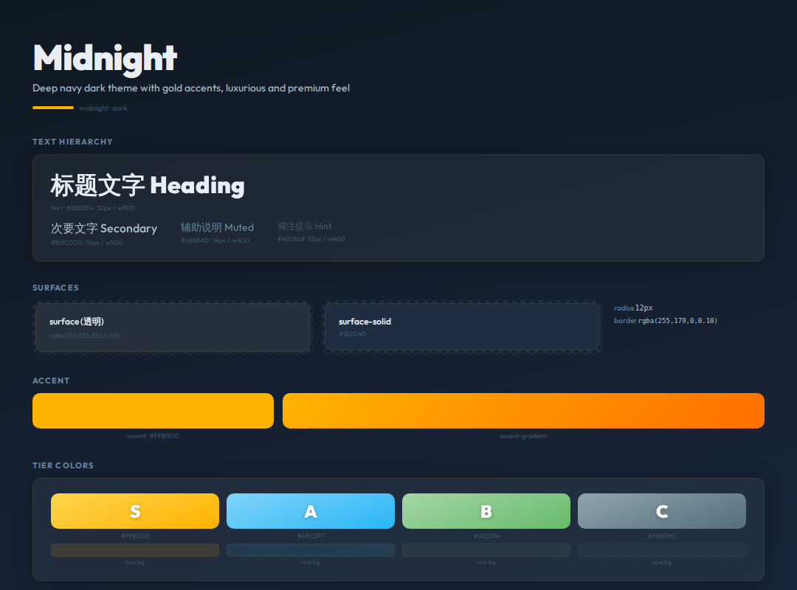

# Midnight




> Deep navy dark theme with gold accents, luxurious and premium feel

**分类**: 暗色 · **ID**: `midnight`

## Background

<div style="width:100%;height:60px;border-radius:8px;background:linear-gradient(165deg, #0F1923 0%, #162233 50%, #1A2940 100%);border:1px solid rgba(128,128,128,0.15);margin:8px 0;"></div>


```css
background: linear-gradient(165deg, #0F1923 0%, #162233 50%, #1A2940 100%);
```

## Surface & Card

<table>
<tr><td>surface</td><td><span style="display:inline-block;width:20px;height:20px;border-radius:4px;background:rgba(255,255,255,0.05);border:1px solid rgba(128,128,128,0.2);vertical-align:middle;"></span></td><td><code>rgba(255,255,255,0.05)</code></td></tr>
<tr><td>surface-solid</td><td><span style="display:inline-block;width:20px;height:20px;border-radius:4px;background:#1E2D40;border:1px solid rgba(128,128,128,0.2);vertical-align:middle;"></span></td><td><code>#1E2D40</code></td></tr>
<tr><td>border</td><td><span style="display:inline-block;width:20px;height:20px;border-radius:4px;background:rgba(255,179,0,0.10);border:1px solid rgba(128,128,128,0.2);vertical-align:middle;"></span></td><td><code>rgba(255,179,0,0.10)</code></td></tr>
<tr><td>card-shadow</td><td></td><td><code>0 4px 24px rgba(0,0,0,0.3)</code></td></tr>
<tr><td>card-radius</td><td></td><td><code>12px</code></td></tr>
<tr><td>card-backdrop</td><td></td><td><code>blur(16px)</code></td></tr>
</table>

## Text

<div style="display:flex;gap:12px;flex-wrap:wrap;margin:12px 0;">
<div style="text-align:center;"><div style="width:80px;height:44px;background:#0F1923;border-radius:6px;border:1px solid rgba(128,128,128,0.15);display:flex;align-items:center;justify-content:center;"><span style="color:#E8EEF4;font-weight:600;font-size:14px;">Aa</span></div><div style="font-size:11px;color:#888;margin-top:4px;">Primary<br/><code style="font-size:10px;">#E8EEF4</code></div></div>
<div style="text-align:center;"><div style="width:80px;height:44px;background:#0F1923;border-radius:6px;border:1px solid rgba(128,128,128,0.15);display:flex;align-items:center;justify-content:center;"><span style="color:#B0C0D0;font-weight:600;font-size:14px;">Aa</span></div><div style="font-size:11px;color:#888;margin-top:4px;">Secondary<br/><code style="font-size:10px;">#B0C0D0</code></div></div>
<div style="text-align:center;"><div style="width:80px;height:44px;background:#0F1923;border-radius:6px;border:1px solid rgba(128,128,128,0.15);display:flex;align-items:center;justify-content:center;"><span style="color:#6888A0;font-weight:600;font-size:14px;">Aa</span></div><div style="font-size:11px;color:#888;margin-top:4px;">Muted<br/><code style="font-size:10px;">#6888A0</code></div></div>
<div style="text-align:center;"><div style="width:80px;height:44px;background:#0F1923;border-radius:6px;border:1px solid rgba(128,128,128,0.15);display:flex;align-items:center;justify-content:center;"><span style="color:#405868;font-weight:600;font-size:14px;">Aa</span></div><div style="font-size:11px;color:#888;margin-top:4px;">Hint<br/><code style="font-size:10px;">#405868</code></div></div>
</div>

## Accent

<div style="display:flex;gap:16px;align-items:center;margin:12px 0;">
<div style="text-align:center;"><div style="width:64px;height:36px;border-radius:6px;background:#FFB300;"></div><div style="font-size:11px;color:#888;margin-top:4px;">Accent<br/><code style="font-size:10px;">#FFB300</code></div></div>
<div style="text-align:center;"><div style="width:120px;height:36px;border-radius:6px;background:linear-gradient(135deg, #FFB300, #FF6F00);"></div><div style="font-size:11px;color:#888;margin-top:4px;">Gradient</div></div>
</div>

## Tier Colors

<div style="display:flex;gap:12px;flex-wrap:wrap;margin:12px 0;">
<div style="text-align:center;"><div style="width:64px;height:44px;border-radius:8px;background:linear-gradient(160deg, #FFD54F, #FFB300);display:flex;align-items:center;justify-content:center;"><span style="color:white;font-weight:900;font-size:20px;text-shadow:0 1px 3px rgba(0,0,0,0.3);">S</span></div><div style="font-size:10px;color:#888;margin-top:4px;"><code>#FFB300</code></div></div>
<div style="text-align:center;"><div style="width:64px;height:44px;border-radius:8px;background:linear-gradient(160deg, #81D4FA, #29B6F6);display:flex;align-items:center;justify-content:center;"><span style="color:white;font-weight:900;font-size:20px;text-shadow:0 1px 3px rgba(0,0,0,0.3);">A</span></div><div style="font-size:10px;color:#888;margin-top:4px;"><code>#4FC3F7</code></div></div>
<div style="text-align:center;"><div style="width:64px;height:44px;border-radius:8px;background:linear-gradient(160deg, #A5D6A7, #66BB6A);display:flex;align-items:center;justify-content:center;"><span style="color:white;font-weight:900;font-size:20px;text-shadow:0 1px 3px rgba(0,0,0,0.3);">B</span></div><div style="font-size:10px;color:#888;margin-top:4px;"><code>#81C784</code></div></div>
<div style="text-align:center;"><div style="width:64px;height:44px;border-radius:8px;background:linear-gradient(160deg, #90A4AE, #546E7A);display:flex;align-items:center;justify-content:center;"><span style="color:white;font-weight:900;font-size:20px;text-shadow:0 1px 3px rgba(0,0,0,0.3);">C</span></div><div style="font-size:10px;color:#888;margin-top:4px;"><code>#78909C</code></div></div>
</div>

<table>
<tr><th>Tier</th><th>Color</th><th>Row BG</th><th>Gradient</th></tr>
<tr><td><strong>S</strong></td><td><span style="display:inline-block;width:20px;height:20px;border-radius:4px;background:#FFB300;border:1px solid rgba(128,128,128,0.2);vertical-align:middle;"></span> <code>#FFB300</code></td><td><span style="display:inline-block;width:20px;height:20px;border-radius:4px;background:rgba(255,179,0,0.12);border:1px solid rgba(128,128,128,0.2);vertical-align:middle;"></span> <code>rgba(255,179,0,0.12)</code></td><td><span style="display:inline-block;width:40px;height:20px;border-radius:4px;background:linear-gradient(160deg, #FFD54F, #FFB300);border:1px solid rgba(128,128,128,0.2);vertical-align:middle;"></span> <code>linear-gradient(160deg, #FFD54F, #FFB300)</code></td></tr>
<tr><td><strong>A</strong></td><td><span style="display:inline-block;width:20px;height:20px;border-radius:4px;background:#4FC3F7;border:1px solid rgba(128,128,128,0.2);vertical-align:middle;"></span> <code>#4FC3F7</code></td><td><span style="display:inline-block;width:20px;height:20px;border-radius:4px;background:rgba(79,195,247,0.10);border:1px solid rgba(128,128,128,0.2);vertical-align:middle;"></span> <code>rgba(79,195,247,0.10)</code></td><td><span style="display:inline-block;width:40px;height:20px;border-radius:4px;background:linear-gradient(160deg, #81D4FA, #29B6F6);border:1px solid rgba(128,128,128,0.2);vertical-align:middle;"></span> <code>linear-gradient(160deg, #81D4FA, #29B6F6)</code></td></tr>
<tr><td><strong>B</strong></td><td><span style="display:inline-block;width:20px;height:20px;border-radius:4px;background:#81C784;border:1px solid rgba(128,128,128,0.2);vertical-align:middle;"></span> <code>#81C784</code></td><td><span style="display:inline-block;width:20px;height:20px;border-radius:4px;background:rgba(129,199,132,0.08);border:1px solid rgba(128,128,128,0.2);vertical-align:middle;"></span> <code>rgba(129,199,132,0.08)</code></td><td><span style="display:inline-block;width:40px;height:20px;border-radius:4px;background:linear-gradient(160deg, #A5D6A7, #66BB6A);border:1px solid rgba(128,128,128,0.2);vertical-align:middle;"></span> <code>linear-gradient(160deg, #A5D6A7, #66BB6A)</code></td></tr>
<tr><td><strong>C</strong></td><td><span style="display:inline-block;width:20px;height:20px;border-radius:4px;background:#78909C;border:1px solid rgba(128,128,128,0.2);vertical-align:middle;"></span> <code>#78909C</code></td><td><span style="display:inline-block;width:20px;height:20px;border-radius:4px;background:rgba(120,144,156,0.06);border:1px solid rgba(128,128,128,0.2);vertical-align:middle;"></span> <code>rgba(120,144,156,0.06)</code></td><td><span style="display:inline-block;width:40px;height:20px;border-radius:4px;background:linear-gradient(160deg, #90A4AE, #546E7A);border:1px solid rgba(128,128,128,0.2);vertical-align:middle;"></span> <code>linear-gradient(160deg, #90A4AE, #546E7A)</code></td></tr>
</table>

## Chart Colors

<div style="display:flex;gap:6px;align-items:center;margin:12px 0;">
<div style="text-align:center;"><div style="width:32px;height:32px;border-radius:50%;background:#FFB300;"></div><div style="font-size:9px;color:#888;margin-top:2px;">1</div></div>
<div style="text-align:center;"><div style="width:32px;height:32px;border-radius:50%;background:#4FC3F7;"></div><div style="font-size:9px;color:#888;margin-top:2px;">2</div></div>
<div style="text-align:center;"><div style="width:32px;height:32px;border-radius:50%;background:#FF7043;"></div><div style="font-size:9px;color:#888;margin-top:2px;">3</div></div>
<div style="text-align:center;"><div style="width:32px;height:32px;border-radius:50%;background:#66BB6A;"></div><div style="font-size:9px;color:#888;margin-top:2px;">4</div></div>
<div style="text-align:center;"><div style="width:32px;height:32px;border-radius:50%;background:#AB47BC;"></div><div style="font-size:9px;color:#888;margin-top:2px;">5</div></div>
<div style="text-align:center;"><div style="width:32px;height:32px;border-radius:50%;background:#78909C;"></div><div style="font-size:9px;color:#888;margin-top:2px;">6</div></div>
</div>

`bar-track`: <span style="display:inline-block;width:20px;height:20px;border-radius:4px;background:rgba(255,255,255,0.06);border:1px solid rgba(128,128,128,0.2);vertical-align:middle;"></span> `rgba(255,255,255,0.06)`

## Typography

<table><tr><th>Role</th><th>Font</th></tr>
<tr><td>heading</td><td><code>Outfit</code></td></tr>
<tr><td>body</td><td><code>Outfit</code></td></tr>
<tr><td>mono</td><td><code>JetBrains Mono</code></td></tr>
<tr><td>cjk</td><td><code>Noto Sans CJK SC</code></td></tr>
</table>

## Decoration

subtle star field dots, opacity 0.03

## 相关
- [[design-tokens]] — 全局共享token
- [[style-graphite]]
- [[style-cosmic]]
