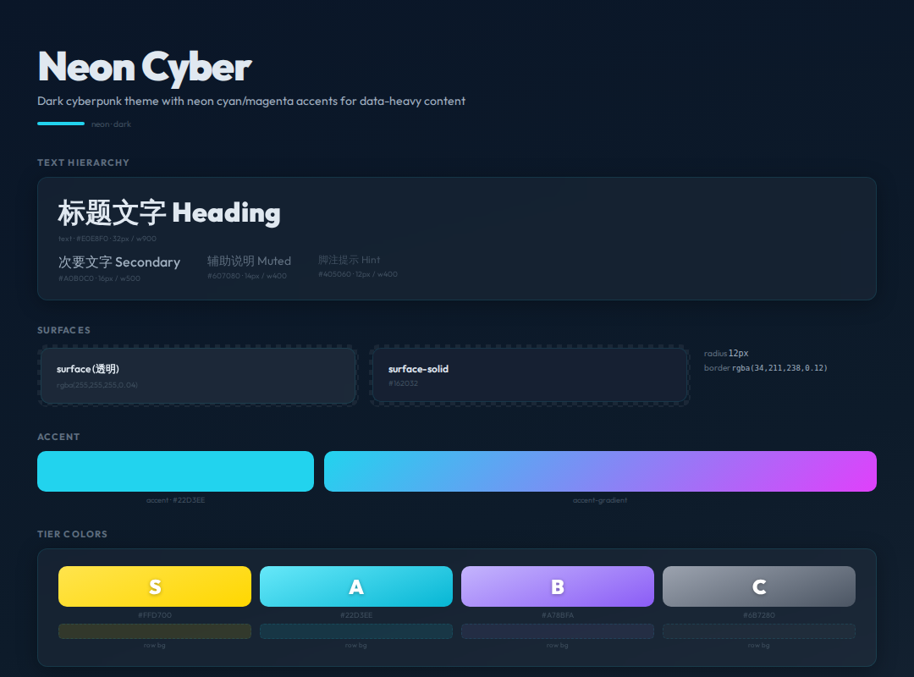

# Neon Cyber




> Dark cyberpunk theme with neon cyan/magenta accents for data-heavy content

**分类**: 暗色 · **ID**: `neon`

## Background

<div style="width:100%;height:60px;border-radius:8px;background:linear-gradient(165deg, #0A1628 0%, #0D1B2A 50%, #1B2838 100%);border:1px solid rgba(128,128,128,0.15);margin:8px 0;"></div>


```css
background: linear-gradient(165deg, #0A1628 0%, #0D1B2A 50%, #1B2838 100%);
```

## Surface & Card

<table>
<tr><td>surface</td><td><span style="display:inline-block;width:20px;height:20px;border-radius:4px;background:rgba(255,255,255,0.04);border:1px solid rgba(128,128,128,0.2);vertical-align:middle;"></span></td><td><code>rgba(255,255,255,0.04)</code></td></tr>
<tr><td>surface-solid</td><td><span style="display:inline-block;width:20px;height:20px;border-radius:4px;background:#162032;border:1px solid rgba(128,128,128,0.2);vertical-align:middle;"></span></td><td><code>#162032</code></td></tr>
<tr><td>border</td><td><span style="display:inline-block;width:20px;height:20px;border-radius:4px;background:rgba(34,211,238,0.12);border:1px solid rgba(128,128,128,0.2);vertical-align:middle;"></span></td><td><code>rgba(34,211,238,0.12)</code></td></tr>
<tr><td>card-shadow</td><td></td><td><code>0 4px 24px rgba(0,0,0,0.3)</code></td></tr>
<tr><td>card-radius</td><td></td><td><code>12px</code></td></tr>
<tr><td>card-backdrop</td><td></td><td><code>blur(16px)</code></td></tr>
</table>

## Text

<div style="display:flex;gap:12px;flex-wrap:wrap;margin:12px 0;">
<div style="text-align:center;"><div style="width:80px;height:44px;background:#0A1628;border-radius:6px;border:1px solid rgba(128,128,128,0.15);display:flex;align-items:center;justify-content:center;"><span style="color:#E0E8F0;font-weight:600;font-size:14px;">Aa</span></div><div style="font-size:11px;color:#888;margin-top:4px;">Primary<br/><code style="font-size:10px;">#E0E8F0</code></div></div>
<div style="text-align:center;"><div style="width:80px;height:44px;background:#0A1628;border-radius:6px;border:1px solid rgba(128,128,128,0.15);display:flex;align-items:center;justify-content:center;"><span style="color:#A0B0C0;font-weight:600;font-size:14px;">Aa</span></div><div style="font-size:11px;color:#888;margin-top:4px;">Secondary<br/><code style="font-size:10px;">#A0B0C0</code></div></div>
<div style="text-align:center;"><div style="width:80px;height:44px;background:#0A1628;border-radius:6px;border:1px solid rgba(128,128,128,0.15);display:flex;align-items:center;justify-content:center;"><span style="color:#607080;font-weight:600;font-size:14px;">Aa</span></div><div style="font-size:11px;color:#888;margin-top:4px;">Muted<br/><code style="font-size:10px;">#607080</code></div></div>
<div style="text-align:center;"><div style="width:80px;height:44px;background:#0A1628;border-radius:6px;border:1px solid rgba(128,128,128,0.15);display:flex;align-items:center;justify-content:center;"><span style="color:#405060;font-weight:600;font-size:14px;">Aa</span></div><div style="font-size:11px;color:#888;margin-top:4px;">Hint<br/><code style="font-size:10px;">#405060</code></div></div>
</div>

## Accent

<div style="display:flex;gap:16px;align-items:center;margin:12px 0;">
<div style="text-align:center;"><div style="width:64px;height:36px;border-radius:6px;background:#22D3EE;"></div><div style="font-size:11px;color:#888;margin-top:4px;">Accent<br/><code style="font-size:10px;">#22D3EE</code></div></div>
<div style="text-align:center;"><div style="width:120px;height:36px;border-radius:6px;background:linear-gradient(135deg, #22D3EE, #E040FB);"></div><div style="font-size:11px;color:#888;margin-top:4px;">Gradient</div></div>
</div>

## Tier Colors

<div style="display:flex;gap:12px;flex-wrap:wrap;margin:12px 0;">
<div style="text-align:center;"><div style="width:64px;height:44px;border-radius:8px;background:linear-gradient(160deg, #FFE44D, #FFD700);display:flex;align-items:center;justify-content:center;"><span style="color:white;font-weight:900;font-size:20px;text-shadow:0 1px 3px rgba(0,0,0,0.3);">S</span></div><div style="font-size:10px;color:#888;margin-top:4px;"><code>#FFD700</code></div></div>
<div style="text-align:center;"><div style="width:64px;height:44px;border-radius:8px;background:linear-gradient(160deg, #67E8F9, #06B6D4);display:flex;align-items:center;justify-content:center;"><span style="color:white;font-weight:900;font-size:20px;text-shadow:0 1px 3px rgba(0,0,0,0.3);">A</span></div><div style="font-size:10px;color:#888;margin-top:4px;"><code>#22D3EE</code></div></div>
<div style="text-align:center;"><div style="width:64px;height:44px;border-radius:8px;background:linear-gradient(160deg, #C4B5FD, #8B5CF6);display:flex;align-items:center;justify-content:center;"><span style="color:white;font-weight:900;font-size:20px;text-shadow:0 1px 3px rgba(0,0,0,0.3);">B</span></div><div style="font-size:10px;color:#888;margin-top:4px;"><code>#A78BFA</code></div></div>
<div style="text-align:center;"><div style="width:64px;height:44px;border-radius:8px;background:linear-gradient(160deg, #9CA3AF, #4B5563);display:flex;align-items:center;justify-content:center;"><span style="color:white;font-weight:900;font-size:20px;text-shadow:0 1px 3px rgba(0,0,0,0.3);">C</span></div><div style="font-size:10px;color:#888;margin-top:4px;"><code>#6B7280</code></div></div>
</div>

<table>
<tr><th>Tier</th><th>Color</th><th>Row BG</th><th>Gradient</th></tr>
<tr><td><strong>S</strong></td><td><span style="display:inline-block;width:20px;height:20px;border-radius:4px;background:#FFD700;border:1px solid rgba(128,128,128,0.2);vertical-align:middle;"></span> <code>#FFD700</code></td><td><span style="display:inline-block;width:20px;height:20px;border-radius:4px;background:rgba(255,215,0,0.12);border:1px solid rgba(128,128,128,0.2);vertical-align:middle;"></span> <code>rgba(255,215,0,0.12)</code></td><td><span style="display:inline-block;width:40px;height:20px;border-radius:4px;background:linear-gradient(160deg, #FFE44D, #FFD700);border:1px solid rgba(128,128,128,0.2);vertical-align:middle;"></span> <code>linear-gradient(160deg, #FFE44D, #FFD700)</code></td></tr>
<tr><td><strong>A</strong></td><td><span style="display:inline-block;width:20px;height:20px;border-radius:4px;background:#22D3EE;border:1px solid rgba(128,128,128,0.2);vertical-align:middle;"></span> <code>#22D3EE</code></td><td><span style="display:inline-block;width:20px;height:20px;border-radius:4px;background:rgba(34,211,238,0.10);border:1px solid rgba(128,128,128,0.2);vertical-align:middle;"></span> <code>rgba(34,211,238,0.10)</code></td><td><span style="display:inline-block;width:40px;height:20px;border-radius:4px;background:linear-gradient(160deg, #67E8F9, #06B6D4);border:1px solid rgba(128,128,128,0.2);vertical-align:middle;"></span> <code>linear-gradient(160deg, #67E8F9, #06B6D4)</code></td></tr>
<tr><td><strong>B</strong></td><td><span style="display:inline-block;width:20px;height:20px;border-radius:4px;background:#A78BFA;border:1px solid rgba(128,128,128,0.2);vertical-align:middle;"></span> <code>#A78BFA</code></td><td><span style="display:inline-block;width:20px;height:20px;border-radius:4px;background:rgba(167,139,250,0.08);border:1px solid rgba(128,128,128,0.2);vertical-align:middle;"></span> <code>rgba(167,139,250,0.08)</code></td><td><span style="display:inline-block;width:40px;height:20px;border-radius:4px;background:linear-gradient(160deg, #C4B5FD, #8B5CF6);border:1px solid rgba(128,128,128,0.2);vertical-align:middle;"></span> <code>linear-gradient(160deg, #C4B5FD, #8B5CF6)</code></td></tr>
<tr><td><strong>C</strong></td><td><span style="display:inline-block;width:20px;height:20px;border-radius:4px;background:#6B7280;border:1px solid rgba(128,128,128,0.2);vertical-align:middle;"></span> <code>#6B7280</code></td><td><span style="display:inline-block;width:20px;height:20px;border-radius:4px;background:rgba(107,114,128,0.08);border:1px solid rgba(128,128,128,0.2);vertical-align:middle;"></span> <code>rgba(107,114,128,0.08)</code></td><td><span style="display:inline-block;width:40px;height:20px;border-radius:4px;background:linear-gradient(160deg, #9CA3AF, #4B5563);border:1px solid rgba(128,128,128,0.2);vertical-align:middle;"></span> <code>linear-gradient(160deg, #9CA3AF, #4B5563)</code></td></tr>
</table>

## Chart Colors

<div style="display:flex;gap:6px;align-items:center;margin:12px 0;">
<div style="text-align:center;"><div style="width:32px;height:32px;border-radius:50%;background:#22D3EE;"></div><div style="font-size:9px;color:#888;margin-top:2px;">1</div></div>
<div style="text-align:center;"><div style="width:32px;height:32px;border-radius:50%;background:#E040FB;"></div><div style="font-size:9px;color:#888;margin-top:2px;">2</div></div>
<div style="text-align:center;"><div style="width:32px;height:32px;border-radius:50%;background:#FFD700;"></div><div style="font-size:9px;color:#888;margin-top:2px;">3</div></div>
<div style="text-align:center;"><div style="width:32px;height:32px;border-radius:50%;background:#34D399;"></div><div style="font-size:9px;color:#888;margin-top:2px;">4</div></div>
<div style="text-align:center;"><div style="width:32px;height:32px;border-radius:50%;background:#FB923C;"></div><div style="font-size:9px;color:#888;margin-top:2px;">5</div></div>
<div style="text-align:center;"><div style="width:32px;height:32px;border-radius:50%;background:#F472B6;"></div><div style="font-size:9px;color:#888;margin-top:2px;">6</div></div>
</div>

`bar-track`: <span style="display:inline-block;width:20px;height:20px;border-radius:4px;background:rgba(255,255,255,0.06);border:1px solid rgba(128,128,128,0.2);vertical-align:middle;"></span> `rgba(255,255,255,0.06)`

## Typography

<table><tr><th>Role</th><th>Font</th></tr>
<tr><td>heading</td><td><code>Outfit</code></td></tr>
<tr><td>body</td><td><code>Outfit</code></td></tr>
<tr><td>mono</td><td><code>JetBrains Mono</code></td></tr>
<tr><td>cjk</td><td><code>Noto Sans CJK SC</code></td></tr>
</table>

## Decoration

horizontal scan lines at 0.03 opacity, subtle glow on accent elements

## 相关
- [[design-tokens]] — 全局共享token
- [[style-graphite]]
- [[style-midnight]]
