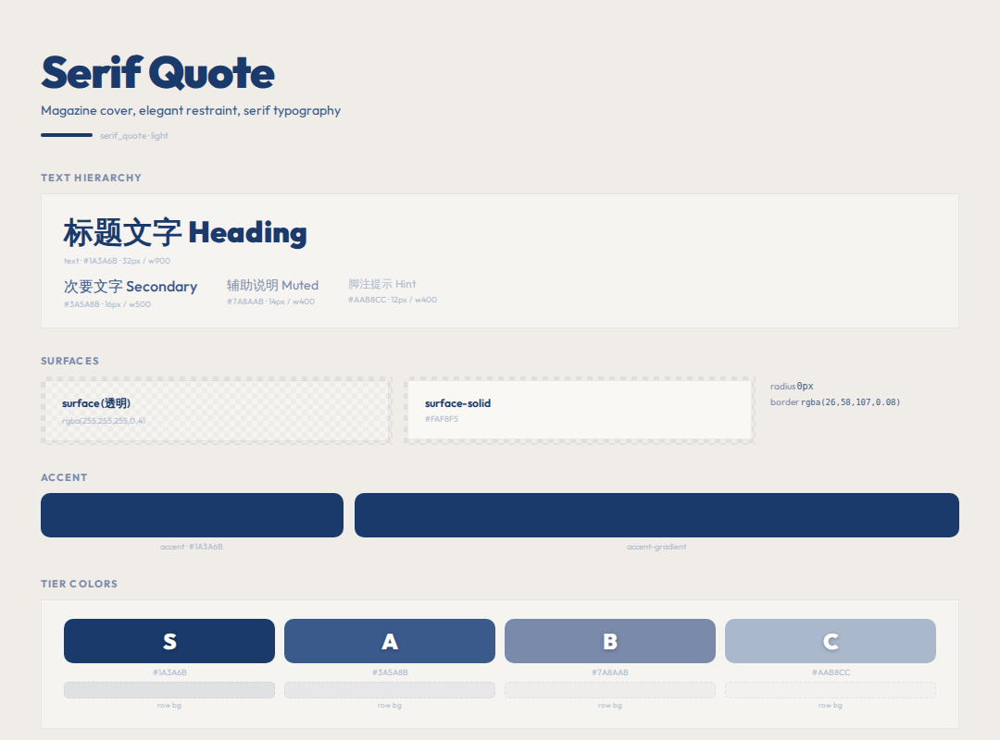

# Serif Quote




> Magazine cover, elegant restraint, serif typography

**分类**: 亮色 · **ID**: `serif_quote`

## Background

<div style="width:100%;height:60px;border-radius:8px;background:#F0EDE8;border:1px solid rgba(128,128,128,0.15);margin:8px 0;"></div>


```css
background: #F0EDE8;
```

## Surface & Card

<table>
<tr><td>surface</td><td><span style="display:inline-block;width:20px;height:20px;border-radius:4px;background:rgba(255,255,255,0.4);border:1px solid rgba(128,128,128,0.2);vertical-align:middle;"></span></td><td><code>rgba(255,255,255,0.4)</code></td></tr>
<tr><td>surface-solid</td><td><span style="display:inline-block;width:20px;height:20px;border-radius:4px;background:#FAF8F5;border:1px solid rgba(128,128,128,0.2);vertical-align:middle;"></span></td><td><code>#FAF8F5</code></td></tr>
<tr><td>border</td><td><span style="display:inline-block;width:20px;height:20px;border-radius:4px;background:rgba(26,58,107,0.08);border:1px solid rgba(128,128,128,0.2);vertical-align:middle;"></span></td><td><code>rgba(26,58,107,0.08)</code></td></tr>
<tr><td>card-shadow</td><td></td><td><code>none</code></td></tr>
<tr><td>card-radius</td><td></td><td><code>0px</code></td></tr>
<tr><td>card-backdrop</td><td></td><td><code>—</code></td></tr>
</table>

## Text

<div style="display:flex;gap:12px;flex-wrap:wrap;margin:12px 0;">
<div style="text-align:center;"><div style="width:80px;height:44px;background:#F0EDE8;border-radius:6px;border:1px solid rgba(128,128,128,0.15);display:flex;align-items:center;justify-content:center;"><span style="color:#1A3A6B;font-weight:600;font-size:14px;">Aa</span></div><div style="font-size:11px;color:#888;margin-top:4px;">Primary<br/><code style="font-size:10px;">#1A3A6B</code></div></div>
<div style="text-align:center;"><div style="width:80px;height:44px;background:#F0EDE8;border-radius:6px;border:1px solid rgba(128,128,128,0.15);display:flex;align-items:center;justify-content:center;"><span style="color:#3A5A8B;font-weight:600;font-size:14px;">Aa</span></div><div style="font-size:11px;color:#888;margin-top:4px;">Secondary<br/><code style="font-size:10px;">#3A5A8B</code></div></div>
<div style="text-align:center;"><div style="width:80px;height:44px;background:#F0EDE8;border-radius:6px;border:1px solid rgba(128,128,128,0.15);display:flex;align-items:center;justify-content:center;"><span style="color:#7A8AAB;font-weight:600;font-size:14px;">Aa</span></div><div style="font-size:11px;color:#888;margin-top:4px;">Muted<br/><code style="font-size:10px;">#7A8AAB</code></div></div>
<div style="text-align:center;"><div style="width:80px;height:44px;background:#F0EDE8;border-radius:6px;border:1px solid rgba(128,128,128,0.15);display:flex;align-items:center;justify-content:center;"><span style="color:#AAB8CC;font-weight:600;font-size:14px;">Aa</span></div><div style="font-size:11px;color:#888;margin-top:4px;">Hint<br/><code style="font-size:10px;">#AAB8CC</code></div></div>
</div>

## Accent

<div style="display:flex;gap:16px;align-items:center;margin:12px 0;">
<div style="text-align:center;"><div style="width:64px;height:36px;border-radius:6px;background:#1A3A6B;"></div><div style="font-size:11px;color:#888;margin-top:4px;">Accent<br/><code style="font-size:10px;">#1A3A6B</code></div></div>
</div>

## Tier Colors

<div style="display:flex;gap:12px;flex-wrap:wrap;margin:12px 0;">
<div style="text-align:center;"><div style="width:64px;height:44px;border-radius:8px;background:#1A3A6B;display:flex;align-items:center;justify-content:center;"><span style="color:white;font-weight:900;font-size:20px;text-shadow:0 1px 3px rgba(0,0,0,0.3);">S</span></div><div style="font-size:10px;color:#888;margin-top:4px;"><code>#1A3A6B</code></div></div>
<div style="text-align:center;"><div style="width:64px;height:44px;border-radius:8px;background:#3A5A8B;display:flex;align-items:center;justify-content:center;"><span style="color:white;font-weight:900;font-size:20px;text-shadow:0 1px 3px rgba(0,0,0,0.3);">A</span></div><div style="font-size:10px;color:#888;margin-top:4px;"><code>#3A5A8B</code></div></div>
<div style="text-align:center;"><div style="width:64px;height:44px;border-radius:8px;background:#7A8AAB;display:flex;align-items:center;justify-content:center;"><span style="color:white;font-weight:900;font-size:20px;text-shadow:0 1px 3px rgba(0,0,0,0.3);">B</span></div><div style="font-size:10px;color:#888;margin-top:4px;"><code>#7A8AAB</code></div></div>
<div style="text-align:center;"><div style="width:64px;height:44px;border-radius:8px;background:#AAB8CC;display:flex;align-items:center;justify-content:center;"><span style="color:white;font-weight:900;font-size:20px;text-shadow:0 1px 3px rgba(0,0,0,0.3);">C</span></div><div style="font-size:10px;color:#888;margin-top:4px;"><code>#AAB8CC</code></div></div>
</div>

<table>
<tr><th>Tier</th><th>Color</th><th>Row BG</th><th>Gradient</th></tr>
<tr><td><strong>S</strong></td><td><span style="display:inline-block;width:20px;height:20px;border-radius:4px;background:#1A3A6B;border:1px solid rgba(128,128,128,0.2);vertical-align:middle;"></span> <code>#1A3A6B</code></td><td><span style="display:inline-block;width:20px;height:20px;border-radius:4px;background:rgba(26,58,107,0.10);border:1px solid rgba(128,128,128,0.2);vertical-align:middle;"></span> <code>rgba(26,58,107,0.10)</code></td><td>— </td></tr>
<tr><td><strong>A</strong></td><td><span style="display:inline-block;width:20px;height:20px;border-radius:4px;background:#3A5A8B;border:1px solid rgba(128,128,128,0.2);vertical-align:middle;"></span> <code>#3A5A8B</code></td><td><span style="display:inline-block;width:20px;height:20px;border-radius:4px;background:rgba(58,90,139,0.08);border:1px solid rgba(128,128,128,0.2);vertical-align:middle;"></span> <code>rgba(58,90,139,0.08)</code></td><td>— </td></tr>
<tr><td><strong>B</strong></td><td><span style="display:inline-block;width:20px;height:20px;border-radius:4px;background:#7A8AAB;border:1px solid rgba(128,128,128,0.2);vertical-align:middle;"></span> <code>#7A8AAB</code></td><td><span style="display:inline-block;width:20px;height:20px;border-radius:4px;background:rgba(122,138,171,0.06);border:1px solid rgba(128,128,128,0.2);vertical-align:middle;"></span> <code>rgba(122,138,171,0.06)</code></td><td>— </td></tr>
<tr><td><strong>C</strong></td><td><span style="display:inline-block;width:20px;height:20px;border-radius:4px;background:#AAB8CC;border:1px solid rgba(128,128,128,0.2);vertical-align:middle;"></span> <code>#AAB8CC</code></td><td><span style="display:inline-block;width:20px;height:20px;border-radius:4px;background:rgba(170,184,204,0.04);border:1px solid rgba(128,128,128,0.2);vertical-align:middle;"></span> <code>rgba(170,184,204,0.04)</code></td><td>— </td></tr>
</table>

## Typography

<table><tr><th>Role</th><th>Font</th></tr>
<tr><td>heading</td><td><code>Outfit</code></td></tr>
<tr><td>body</td><td><code>Outfit</code></td></tr>
<tr><td>cjk</td><td><code>Noto Sans CJK SC</code></td></tr>
</table>

## 相关
- [[design-tokens]] — 全局共享token
- [[style-cream]]
- [[style-sigma]]
