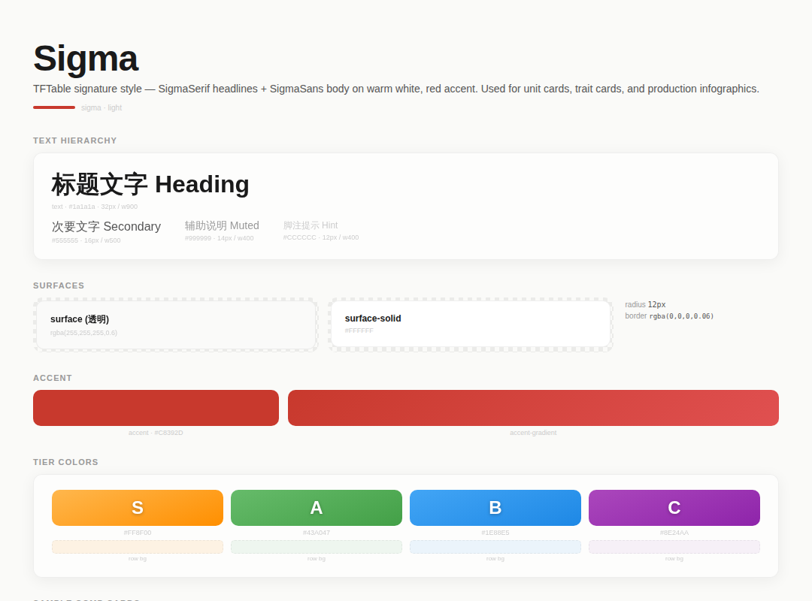

# Sigma




> TFTable signature style — SigmaSerif headlines + SigmaSans body on warm white, red accent. Used for unit cards, trait cards, and production infographics.

**分类**: 亮色 · **ID**: `sigma`

## Background

<div style="width:100%;height:60px;border-radius:8px;background:#FAFAF8;border:1px solid rgba(128,128,128,0.15);margin:8px 0;"></div>


```css
background: #FAFAF8;
```

## Surface & Card

<table>
<tr><td>surface</td><td><span style="display:inline-block;width:20px;height:20px;border-radius:4px;background:rgba(255,255,255,0.6);border:1px solid rgba(128,128,128,0.2);vertical-align:middle;"></span></td><td><code>rgba(255,255,255,0.6)</code></td></tr>
<tr><td>surface-solid</td><td><span style="display:inline-block;width:20px;height:20px;border-radius:4px;background:#FFFFFF;border:1px solid rgba(128,128,128,0.2);vertical-align:middle;"></span></td><td><code>#FFFFFF</code></td></tr>
<tr><td>border</td><td><span style="display:inline-block;width:20px;height:20px;border-radius:4px;background:rgba(0,0,0,0.06);border:1px solid rgba(128,128,128,0.2);vertical-align:middle;"></span></td><td><code>rgba(0,0,0,0.06)</code></td></tr>
<tr><td>card-shadow</td><td></td><td><code>0 4px 20px rgba(0,0,0,0.06)</code></td></tr>
<tr><td>card-radius</td><td></td><td><code>12px</code></td></tr>
<tr><td>card-backdrop</td><td></td><td><code>blur(8px)</code></td></tr>
</table>

## Text

<div style="display:flex;gap:12px;flex-wrap:wrap;margin:12px 0;">
<div style="text-align:center;"><div style="width:80px;height:44px;background:#FAFAF8;border-radius:6px;border:1px solid rgba(128,128,128,0.15);display:flex;align-items:center;justify-content:center;"><span style="color:#1a1a1a;font-weight:600;font-size:14px;">Aa</span></div><div style="font-size:11px;color:#888;margin-top:4px;">Primary<br/><code style="font-size:10px;">#1a1a1a</code></div></div>
<div style="text-align:center;"><div style="width:80px;height:44px;background:#FAFAF8;border-radius:6px;border:1px solid rgba(128,128,128,0.15);display:flex;align-items:center;justify-content:center;"><span style="color:#555555;font-weight:600;font-size:14px;">Aa</span></div><div style="font-size:11px;color:#888;margin-top:4px;">Secondary<br/><code style="font-size:10px;">#555555</code></div></div>
<div style="text-align:center;"><div style="width:80px;height:44px;background:#FAFAF8;border-radius:6px;border:1px solid rgba(128,128,128,0.15);display:flex;align-items:center;justify-content:center;"><span style="color:#999999;font-weight:600;font-size:14px;">Aa</span></div><div style="font-size:11px;color:#888;margin-top:4px;">Muted<br/><code style="font-size:10px;">#999999</code></div></div>
<div style="text-align:center;"><div style="width:80px;height:44px;background:#FAFAF8;border-radius:6px;border:1px solid rgba(128,128,128,0.15);display:flex;align-items:center;justify-content:center;"><span style="color:#CCCCCC;font-weight:600;font-size:14px;">Aa</span></div><div style="font-size:11px;color:#888;margin-top:4px;">Hint<br/><code style="font-size:10px;">#CCCCCC</code></div></div>
</div>

## Accent

<div style="display:flex;gap:16px;align-items:center;margin:12px 0;">
<div style="text-align:center;"><div style="width:64px;height:36px;border-radius:6px;background:#C8392D;"></div><div style="font-size:11px;color:#888;margin-top:4px;">Accent<br/><code style="font-size:10px;">#C8392D</code></div></div>
<div style="text-align:center;"><div style="width:120px;height:36px;border-radius:6px;background:linear-gradient(135deg, #C8392D, #E05050);"></div><div style="font-size:11px;color:#888;margin-top:4px;">Gradient</div></div>
</div>

## Tier Colors

<div style="display:flex;gap:12px;flex-wrap:wrap;margin:12px 0;">
<div style="text-align:center;"><div style="width:64px;height:44px;border-radius:8px;background:linear-gradient(160deg, #FFB74D, #FF8F00);display:flex;align-items:center;justify-content:center;"><span style="color:white;font-weight:900;font-size:20px;text-shadow:0 1px 3px rgba(0,0,0,0.3);">S</span></div><div style="font-size:10px;color:#888;margin-top:4px;"><code>#FF8F00</code></div></div>
<div style="text-align:center;"><div style="width:64px;height:44px;border-radius:8px;background:linear-gradient(160deg, #66BB6A, #43A047);display:flex;align-items:center;justify-content:center;"><span style="color:white;font-weight:900;font-size:20px;text-shadow:0 1px 3px rgba(0,0,0,0.3);">A</span></div><div style="font-size:10px;color:#888;margin-top:4px;"><code>#43A047</code></div></div>
<div style="text-align:center;"><div style="width:64px;height:44px;border-radius:8px;background:linear-gradient(160deg, #42A5F5, #1E88E5);display:flex;align-items:center;justify-content:center;"><span style="color:white;font-weight:900;font-size:20px;text-shadow:0 1px 3px rgba(0,0,0,0.3);">B</span></div><div style="font-size:10px;color:#888;margin-top:4px;"><code>#1E88E5</code></div></div>
<div style="text-align:center;"><div style="width:64px;height:44px;border-radius:8px;background:linear-gradient(160deg, #AB47BC, #8E24AA);display:flex;align-items:center;justify-content:center;"><span style="color:white;font-weight:900;font-size:20px;text-shadow:0 1px 3px rgba(0,0,0,0.3);">C</span></div><div style="font-size:10px;color:#888;margin-top:4px;"><code>#8E24AA</code></div></div>
</div>

<table>
<tr><th>Tier</th><th>Color</th><th>Row BG</th><th>Gradient</th></tr>
<tr><td><strong>S</strong></td><td><span style="display:inline-block;width:20px;height:20px;border-radius:4px;background:#FF8F00;border:1px solid rgba(128,128,128,0.2);vertical-align:middle;"></span> <code>#FF8F00</code></td><td><span style="display:inline-block;width:20px;height:20px;border-radius:4px;background:rgba(255,143,0,0.10);border:1px solid rgba(128,128,128,0.2);vertical-align:middle;"></span> <code>rgba(255,143,0,0.10)</code></td><td><span style="display:inline-block;width:40px;height:20px;border-radius:4px;background:linear-gradient(160deg, #FFB74D, #FF8F00);border:1px solid rgba(128,128,128,0.2);vertical-align:middle;"></span> <code>linear-gradient(160deg, #FFB74D, #FF8F00)</code></td></tr>
<tr><td><strong>A</strong></td><td><span style="display:inline-block;width:20px;height:20px;border-radius:4px;background:#43A047;border:1px solid rgba(128,128,128,0.2);vertical-align:middle;"></span> <code>#43A047</code></td><td><span style="display:inline-block;width:20px;height:20px;border-radius:4px;background:rgba(67,160,71,0.08);border:1px solid rgba(128,128,128,0.2);vertical-align:middle;"></span> <code>rgba(67,160,71,0.08)</code></td><td><span style="display:inline-block;width:40px;height:20px;border-radius:4px;background:linear-gradient(160deg, #66BB6A, #43A047);border:1px solid rgba(128,128,128,0.2);vertical-align:middle;"></span> <code>linear-gradient(160deg, #66BB6A, #43A047)</code></td></tr>
<tr><td><strong>B</strong></td><td><span style="display:inline-block;width:20px;height:20px;border-radius:4px;background:#1E88E5;border:1px solid rgba(128,128,128,0.2);vertical-align:middle;"></span> <code>#1E88E5</code></td><td><span style="display:inline-block;width:20px;height:20px;border-radius:4px;background:rgba(30,136,229,0.08);border:1px solid rgba(128,128,128,0.2);vertical-align:middle;"></span> <code>rgba(30,136,229,0.08)</code></td><td><span style="display:inline-block;width:40px;height:20px;border-radius:4px;background:linear-gradient(160deg, #42A5F5, #1E88E5);border:1px solid rgba(128,128,128,0.2);vertical-align:middle;"></span> <code>linear-gradient(160deg, #42A5F5, #1E88E5)</code></td></tr>
<tr><td><strong>C</strong></td><td><span style="display:inline-block;width:20px;height:20px;border-radius:4px;background:#8E24AA;border:1px solid rgba(128,128,128,0.2);vertical-align:middle;"></span> <code>#8E24AA</code></td><td><span style="display:inline-block;width:20px;height:20px;border-radius:4px;background:rgba(142,36,170,0.06);border:1px solid rgba(128,128,128,0.2);vertical-align:middle;"></span> <code>rgba(142,36,170,0.06)</code></td><td><span style="display:inline-block;width:40px;height:20px;border-radius:4px;background:linear-gradient(160deg, #AB47BC, #8E24AA);border:1px solid rgba(128,128,128,0.2);vertical-align:middle;"></span> <code>linear-gradient(160deg, #AB47BC, #8E24AA)</code></td></tr>
</table>

## Chart Colors

<div style="display:flex;gap:6px;align-items:center;margin:12px 0;">
<div style="text-align:center;"><div style="width:32px;height:32px;border-radius:50%;background:#C8392D;"></div><div style="font-size:9px;color:#888;margin-top:2px;">1</div></div>
<div style="text-align:center;"><div style="width:32px;height:32px;border-radius:50%;background:#43A047;"></div><div style="font-size:9px;color:#888;margin-top:2px;">2</div></div>
<div style="text-align:center;"><div style="width:32px;height:32px;border-radius:50%;background:#1E88E5;"></div><div style="font-size:9px;color:#888;margin-top:2px;">3</div></div>
<div style="text-align:center;"><div style="width:32px;height:32px;border-radius:50%;background:#FF8F00;"></div><div style="font-size:9px;color:#888;margin-top:2px;">4</div></div>
<div style="text-align:center;"><div style="width:32px;height:32px;border-radius:50%;background:#8E24AA;"></div><div style="font-size:9px;color:#888;margin-top:2px;">5</div></div>
<div style="text-align:center;"><div style="width:32px;height:32px;border-radius:50%;background:#00BCD4;"></div><div style="font-size:9px;color:#888;margin-top:2px;">6</div></div>
</div>

`bar-track`: <span style="display:inline-block;width:20px;height:20px;border-radius:4px;background:rgba(0,0,0,0.06);border:1px solid rgba(128,128,128,0.2);vertical-align:middle;"></span> `rgba(0,0,0,0.06)`

## Typography

<table><tr><th>Role</th><th>Font</th></tr>
<tr><td>heading</td><td><code>SigmaSerifHead</code></td></tr>
<tr><td>body</td><td><code>SigmaSans</code></td></tr>
<tr><td>serif-text</td><td><code>SigmaSerifText</code></td></tr>
<tr><td>mono</td><td><code>JetBrains Mono</code></td></tr>
<tr><td>cjk</td><td><code>Noto Sans CJK SC</code></td></tr>
</table>

## Stat Colors

<div style="display:flex;gap:8px;flex-wrap:wrap;margin:12px 0;">
<div style="text-align:center;"><div style="width:36px;height:36px;border-radius:6px;background:#e05050;display:flex;align-items:center;justify-content:center;"></div><div style="font-size:10px;color:#888;margin-top:3px;">hp<br/><code style="font-size:9px;">#e05050</code></div></div>
<div style="text-align:center;"><div style="width:36px;height:36px;border-radius:6px;background:#ff8c42;display:flex;align-items:center;justify-content:center;"></div><div style="font-size:10px;color:#888;margin-top:3px;">damage<br/><code style="font-size:9px;">#ff8c42</code></div></div>
<div style="text-align:center;"><div style="width:36px;height:36px;border-radius:6px;background:#b06cdd;display:flex;align-items:center;justify-content:center;"></div><div style="font-size:10px;color:#888;margin-top:3px;">abilityPower<br/><code style="font-size:9px;">#b06cdd</code></div></div>
<div style="text-align:center;"><div style="width:36px;height:36px;border-radius:6px;background:#7a8c20;display:flex;align-items:center;justify-content:center;"></div><div style="font-size:10px;color:#888;margin-top:3px;">attackSpeed<br/><code style="font-size:9px;">#7a8c20</code></div></div>
<div style="text-align:center;"><div style="width:36px;height:36px;border-radius:6px;background:#d4a830;display:flex;align-items:center;justify-content:center;"></div><div style="font-size:10px;color:#888;margin-top:3px;">armor<br/><code style="font-size:9px;">#d4a830</code></div></div>
<div style="text-align:center;"><div style="width:36px;height:36px;border-radius:6px;background:#4488cc;display:flex;align-items:center;justify-content:center;"></div><div style="font-size:10px;color:#888;margin-top:3px;">magicResist<br/><code style="font-size:9px;">#4488cc</code></div></div>
<div style="text-align:center;"><div style="width:36px;height:36px;border-radius:6px;background:#3399ff;display:flex;align-items:center;justify-content:center;"></div><div style="font-size:10px;color:#888;margin-top:3px;">mana<br/><code style="font-size:9px;">#3399ff</code></div></div>
<div style="text-align:center;"><div style="width:36px;height:36px;border-radius:6px;background:#cc7733;display:flex;align-items:center;justify-content:center;"></div><div style="font-size:10px;color:#888;margin-top:3px;">range<br/><code style="font-size:9px;">#cc7733</code></div></div>
</div>

## Cost Colors

<div style="display:flex;gap:12px;margin:12px 0;">
<div style="text-align:center;"><div style="width:40px;height:40px;border-radius:50%;background:#808080;display:flex;align-items:center;justify-content:center;"><span style="color:white;font-weight:700;font-size:16px;text-shadow:0 1px 2px rgba(0,0,0,0.3);">1</span></div><div style="font-size:10px;color:#888;margin-top:3px;"><code>#808080</code></div></div>
<div style="text-align:center;"><div style="width:40px;height:40px;border-radius:50%;background:#11b288;display:flex;align-items:center;justify-content:center;"><span style="color:white;font-weight:700;font-size:16px;text-shadow:0 1px 2px rgba(0,0,0,0.3);">2</span></div><div style="font-size:10px;color:#888;margin-top:3px;"><code>#11b288</code></div></div>
<div style="text-align:center;"><div style="width:40px;height:40px;border-radius:50%;background:#207ac7;display:flex;align-items:center;justify-content:center;"><span style="color:white;font-weight:700;font-size:16px;text-shadow:0 1px 2px rgba(0,0,0,0.3);">3</span></div><div style="font-size:10px;color:#888;margin-top:3px;"><code>#207ac7</code></div></div>
<div style="text-align:center;"><div style="width:40px;height:40px;border-radius:50%;background:#c440da;display:flex;align-items:center;justify-content:center;"><span style="color:white;font-weight:700;font-size:16px;text-shadow:0 1px 2px rgba(0,0,0,0.3);">4</span></div><div style="font-size:10px;color:#888;margin-top:3px;"><code>#c440da</code></div></div>
<div style="text-align:center;"><div style="width:40px;height:40px;border-radius:50%;background:#ffb93b;display:flex;align-items:center;justify-content:center;"><span style="color:white;font-weight:700;font-size:16px;text-shadow:0 1px 2px rgba(0,0,0,0.3);">5</span></div><div style="font-size:10px;color:#888;margin-top:3px;"><code>#ffb93b</code></div></div>
</div>

## Typography Rules

- **headline-style**: SigmaSerifHead, font-weight 500, tight line-height (0.95-1.1)
- **body-style**: SigmaSans, font-weight 400-500
- **label-style**: SigmaSerifHead, letter-spacing 0.08-0.12em, uppercase, color text-muted
- **stat-value-style**: SigmaSerifHead, font-size 28px, font-weight 500
- **keyword-highlight**: strong, color accent, font-family SigmaSerifHead

## Decoration

clean, minimal — no patterns, rely on typography hierarchy

## 相关
- [[design-tokens]] — 全局共享token
- [[style-cream]]
- [[style-gradient-tech]]
