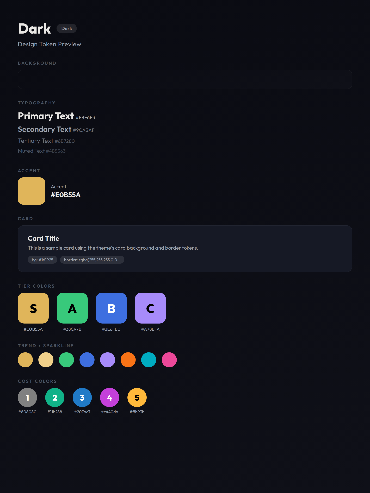

# Theme: Dark 深色主题



**类型：** 深色主题（Dark）
**用途：** Twitter、Reddit 等海外社媒图。

基础通用 token 见 [[design-tokens]]。

## CSS Variables

```css
[data-theme="dark"] {
  /* Background */
  --bg: #0A0B12;

  /* Card */
  --card-bg: #161925;

  /* Accent */
  --accent: #E0B55A;

  /* Text */
  --text-primary: #E8E6E3;
  --text-secondary: #9CA3AF;
  --text-tertiary: #6B7280;
  --text-muted: #4B5563;

  /* Tier */
  --tier-s: #E0B55A;
  --tier-a: #38C97B;
  --tier-b: #3E6FE0;
  --tier-c: #A78BFA;
}
```

## 色板

| Token | 色值 | 用途 |
|-------|------|------|
| `--bg` | `#0A0B12` | 背景（近纯黑微蓝） |
| `--card-bg` | `#161925` | 卡片背景 |
| `--accent` | `#E0B55A` | 强调色/金 |
| `--text-primary` | `#E8E6E3` | 主文字 |
| `--text-secondary` | `#9CA3AF` | 副文字 |
| `--text-tertiary` | `#6B7280` | 辅助文字 |
| `--text-muted` | `#4B5563` | 弱化文字 |

## Tier 系统

| Tier | 色值 | 描述 |
|------|------|------|
| S | `#E0B55A` | 金 |
| A | `#38C97B` | 翠绿 |
| B | `#3E6FE0` | 蓝 |
| C | `#A78BFA` | 淡紫 |
