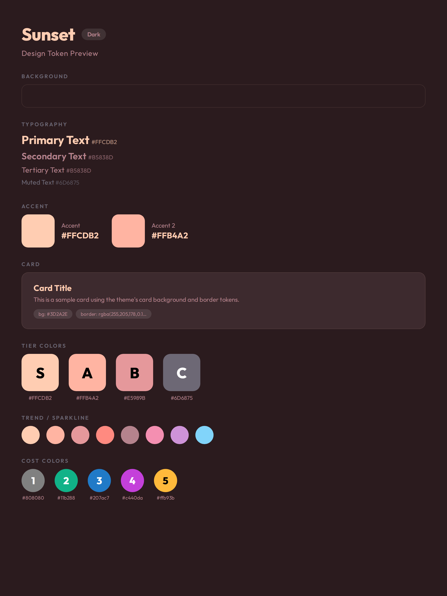

# Theme: Sunset 日落沙滩深色主题



**类型：** 深色主题（Dark）
**用途：** 暖色调深色风格，日落/沙滩氛围。

基础通用 token 见 [[design-tokens]]。

## CSS Variables

```css
[data-theme="sunset"] {
  /* Background */
  --bg: #2B1B1E;

  /* Card */
  --card-bg: #3D2A2E;
  --card-border: rgba(255, 205, 178, 0.12);

  /* Brand / Accent */
  --brand: #FFCDB2;
  --accent-2: #FFB4A2;

  /* Text */
  --text-primary: #FFCDB2;
  --text-secondary: #B5838D;

  /* Tier */
  --tier-s: #FFCDB2;
  --tier-a: #FFB4A2;
  --tier-b: #E5989B;
  --tier-c: #6D6875;

  /* Sparkline / Chart */
  --spark-1: #FFCDB2;
  --spark-2: #FFB4A2;
  --spark-3: #E5989B;
  --spark-4: #FF8A80;
  --spark-5: #B5838D;
  --spark-6: #F48FB1;
  --spark-7: #CE93D8;
  --spark-8: #81D4FA;
}
```

## 色板

| Token | 色值 | 用途 |
|-------|------|------|
| `--bg` | `#2B1B1E` | 深暖棕背景 |
| `--card-bg` | `#3D2A2E` | 卡片背景 |
| `--card-border` | `rgba(255,205,178,0.12)` | 卡片边框 |
| `--brand` | `#FFCDB2` | 品牌色（浅桃） |
| `--accent-2` | `#FFB4A2` | 强调色（粉珊瑚） |
| `--text-primary` | `#FFCDB2` | 主文字 |
| `--text-secondary` | `#B5838D` | 辅助文字 |

## Tier 系统

| Tier | 色值 | 描述 |
|------|------|------|
| S | `#FFCDB2` | 浅桃 |
| A | `#FFB4A2` | 粉珊瑚 |
| B | `#E5989B` | 玫瑰粉 |
| C | `#6D6875` | 灰紫 |

## 趋势线/图表色

`#FFCDB2` · `#FFB4A2` · `#E5989B` · `#FF8A80` · `#B5838D` · `#F48FB1` · `#CE93D8` · `#81D4FA`
