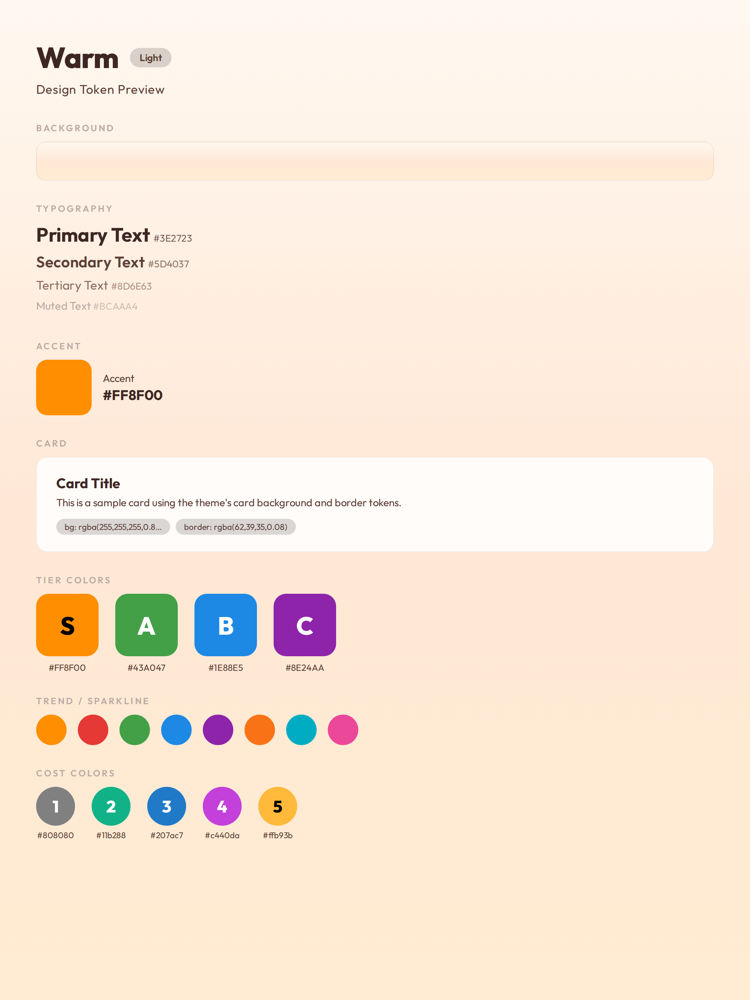

# Theme: Warm/Cream 暖色主题



**类型：** 浅色主题（Light）
**用途：** 小红书、抖音等中文社媒图。默认主题。

基础通用 token 见 [[design-tokens]]。

## CSS Variables

```css
:root {
  /* Background */
  --bg-gradient: linear-gradient(180deg, #FFF8F0 0%, #FFE8D6 50%, #FFECD2 100%);
  --bg-start: #FFF8F0;
  --bg-mid: #FFE8D6;
  --bg-end: #FFECD2;

  /* Accent */
  --accent: #FF8F00;

  /* Text */
  --text-primary: #3E2723;
  --text-secondary: #5D4037;
  --text-tertiary: #8D6E63;
  --text-muted: #BCAAA4;

  /* Card */
  --card-bg: rgba(255, 255, 255, 0.85);
  --card-border: rgba(62, 39, 35, 0.08);

  /* Tier */
  --tier-s: #FF8F00;
  --tier-a: #43A047;
  --tier-b: #1E88E5;
  --tier-c: #8E24AA;
}
```

## 色板

| Token | 色值 | 用途 |
|-------|------|------|
| `--bg-start` | `#FFF8F0` | 背景渐变起点 |
| `--bg-mid` | `#FFE8D6` | 背景渐变中段 |
| `--bg-end` | `#FFECD2` | 背景渐变终点 |
| `--accent` | `#FF8F00` | 强调色/品牌橙 |
| `--text-primary` | `#3E2723` | 主文字（深棕） |
| `--text-secondary` | `#5D4037` | 副文字 |
| `--text-tertiary` | `#8D6E63` | 辅助文字 |
| `--text-muted` | `#BCAAA4` | 弱化文字 |

## Tier 系统

| Tier | 色值 | 描述 |
|------|------|------|
| S | `#FF8F00` | 橙金 |
| A | `#43A047` | 绿 |
| B | `#1E88E5` | 蓝 |
| C | `#8E24AA` | 紫 |
